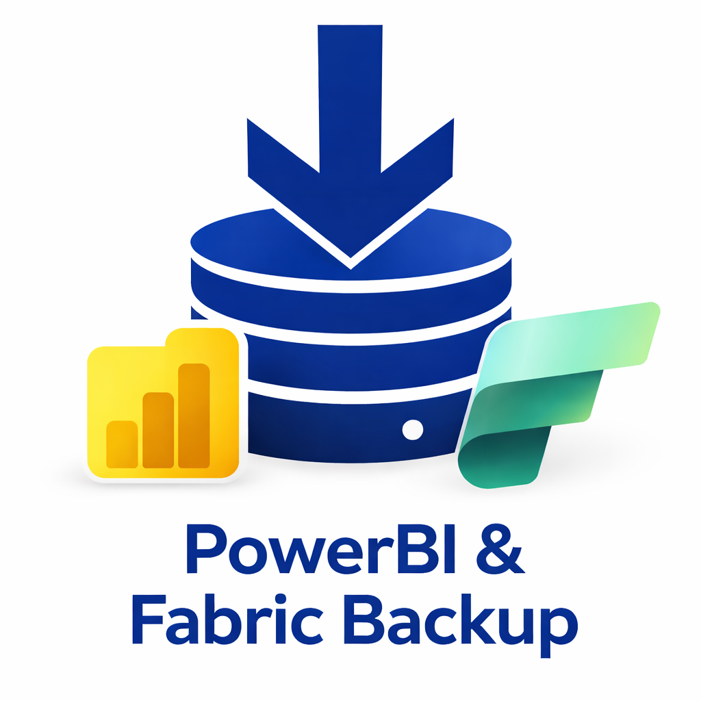

# Fabric Backup Lite

<p align="center">
  
</p>

<p align="center">
  Herramienta gratuita de backup para <strong>Microsoft Fabric</strong> y <strong>Power BI</strong>, con instalador MSI para Windows.
</p>

<p align="center">
  
  
  
  
</p>

---

## ¿Qué hace?

Fabric Backup Lite se conecta a tu tenant de Microsoft Fabric/Power BI mediante la API REST oficial y descarga las definiciones de tus artefactos a carpetas locales, preservando estructura y metadata.

| Tipo de ítem | Formato guardado | Estado |
|---|---|---|
| Notebooks | `.ipynb` | ✅ Soportado |
| Data Pipelines | `.json` | ✅ Soportado |
| Dataflows Gen2 | `.json` | ✅ Soportado |
| Reports (Power BI) | PBIR (múltiples `.json`) | ✅ Soportado |
| Semantic Models | `.bim` | ✅ Soportado* |
| Lakehouses | — | ⛔ API no disponible aún |
| Warehouses | — | ⛔ API no disponible aún |
| KQL Databases | — | ⛔ API no disponible aún |

> \* Los Semantic Models requieren capacidad Premium para exportar. Los ítems no soportados aparecen visibles en la UI pero con checkbox deshabilitado y tooltip explicativo.

---

## Instalación (usuarios finales)

1. Descargá el instalador MSI desde la sección [**Releases**](https://github.com/wcalcagno/fabric-backup-lite/releases)
2. Ejecutá `FabricBackupLite.msi` como administrador
3. El instalador crea accesos directos en Escritorio y Menú Inicio
4. **No se necesita instalar .NET** — el ejecutable es autocontenido

---

## Configuración: Azure AD App Registration

La app usa autenticación delegada con MSAL. Necesitás registrar una aplicación en tu tenant:

1. Ir a [portal.azure.com](https://portal.azure.com) → **Azure Active Directory** → **App registrations** → **New registration**
2. Nombre: `Fabric Backup Lite` (o el que prefieras)
3. Supported account types: `Accounts in this organizational directory only`
4. Redirect URI: plataforma **Public client/native**, URI: `http://localhost`
5. Click **Register** y copiar el **Application (client) ID**
6. Ir a **API permissions** → **Add a permission** → **APIs my organization uses** → buscar **Power BI Service**
7. Agregar permisos delegados:
   - `Workspace.Read.All`
   - `Item.ReadAll` (o `Item.ReadWrite.All`)
8. Click **Grant admin consent**

Luego, editar `appsettings.json` en la carpeta de instalación (`C:\Program Files\WeData\Fabric Backup Lite\`):

```json
{
  "Authentication": {
    "ClientId": "TU-CLIENT-ID-AQUI",
    "TenantId": "TU-TENANT-ID-AQUI",
    "RedirectUri": "http://localhost",
    "Scopes": [
      "https://analysis.windows.net/powerbi/api/Workspace.Read.All"
    ]
  }
}
```

---

## Cómo usar

### 1. Iniciar sesión
Hacer click en **"Iniciar sesión"**. Se abre el navegador para autenticación con Microsoft. Una vez autenticado, la app carga automáticamente los workspaces del tenant.

### 2. Explorar y seleccionar ítems
El panel izquierdo muestra un árbol con todos los workspaces y sus artefactos, organizados por tipo. Podés:
- Marcar/desmarcar **ítems individuales**
- Marcar un **tipo completo** (ej.: todos los Notebooks)
- Marcar un **workspace completo**
- Usar los botones **"✓ Todo"** y **"✗ Ninguno"**

Los ítems en gris itálico (Lakehouses, Warehouses, KQL Databases) no tienen API de exportación disponible en Microsoft Fabric todavía.

### 3. Elegir carpeta de destino
Click en **"Examinar..."** y seleccioná la carpeta donde querés guardar los backups.

### 4. Iniciar backup
Click en **"▶ Iniciar Backup"**. El log de actividad muestra el progreso en tiempo real. Podés cancelar en cualquier momento con **"✕ Cancelar"**.

### 5. Resultado en disco

```
{CarpetaDestino}/
└── {TenantId}/
    └── {WorkspaceName}_{WorkspaceId}/
        └── {Timestamp}_backup/
            ├── manifest.json               ← metadata de todos los ítems
            ├── Notebooks/
            │   └── mi_notebook_1234567890/
            │       └── notebook-content.ipynb
            ├── Reports/
            │   └── mi_reporte_1234567890/
            │       ├── report.json         ← formato PBIR
            │       └── pages/
            │           └── ...
            ├── Pipelines/
            │   └── mi_pipeline_1234567890/
            │       └── pipeline-content.json
            ├── Dataflows/
            │   └── mi_dataflow_1234567890/
            │       └── definition.json
            └── SemanticModels/
                └── mi_modelo_1234567890/
                    └── model.bim
```

---

## Logs

Los logs se escriben en:
```
%APPDATA%\WeData\FabricBackupLite\logs\fabric-backup-YYYYMMDD.txt
```
es decir:
```
C:\Users\{tu_usuario}\AppData\Roaming\WeData\FabricBackupLite\logs\
```

---

## Troubleshooting

| Error | Causa probable | Solución |
|---|---|---|
| `GetDefinition failed: BadRequest` | Formato de exportación no soportado para ese tipo | El tipo de ítem no puede exportarse con la API actual |
| `LRO failed: Premium capacity connection health issue` | El Semantic Model requiere capacidad Premium | Necesitás capacidad Premium F SKU activa en ese workspace |
| `401 Unauthorized` | Token expirado o permisos insuficientes | Cerrá sesión y volvé a autenticarte |
| `403 Forbidden` | Sin acceso al workspace | Pedí al administrador del workspace que te agregue |
| `No Location header in 202 response` | La API de Fabric cambió su comportamiento | Reportar como issue en GitHub |
| `Timeout en LRO polling` | El ítem es muy grande o la capacidad está cargada | Aumentar `LROPollingInterval` en `appsettings.json` |

---

## Compilar desde código fuente

### Requisitos
- [.NET 8 SDK](https://dotnet.microsoft.com/download/dotnet/8.0)
- Windows 10/11
- Visual Studio 2022 o VS Code con extensión C#

### Pasos

```bash
git clone https://github.com/wcalcagno/fabric-backup-lite.git
cd fabric-backup-lite
dotnet restore src/Fabric_backup_lite/Fabric_backup_lite.csproj
dotnet run --project src/Fabric_backup_lite/Fabric_backup_lite.csproj
```

### Generar MSI

```powershell
# 1. Publicar app
dotnet publish src/Fabric_backup_lite -c Release -r win-x64 --self-contained true -o installer/publish

# 2. Generar Files.wxs
powershell -ExecutionPolicy Bypass -File installer/GenerateFiles.ps1

# 3. Compilar MSI (requiere dotnet tool install --global wix)
dotnet build installer/wix/FabricBackupLite.wixproj -c Release
```

El MSI queda en `installer/wix/bin/x64/Release/FabricBackupLite.msi`.

---

## Arquitectura

```
src/Fabric_backup_lite/
├── Assets/                  # Íconos
├── Models/                  # FabricItem, Workspace, WorkspaceTreeNode, etc.
├── Services/
│   ├── AuthenticationService.cs   # MSAL — autenticación delegada
│   ├── FabricApiClient.cs         # Cliente REST con LRO polling y reintentos
│   ├── BackupService.cs           # Orquestación: selección → descarga → guardado
│   └── FileSystemService.cs       # Escritura de archivos y manifest
├── ViewModels/
│   └── MainViewModel.cs           # MVVM, ICommand, IProgress<T>
└── Views/
    ├── MainWindow.xaml            # UI principal con TreeView de checkboxes
    └── MainWindow.xaml.cs
```

**Stack**: .NET 8 · WPF · MVVM · MSAL.NET · Fabric REST API v1 · Polly · Serilog · WiX Toolset v6

---

## Limitaciones conocidas (v1.4)

- ❌ **Solo backup, no restore** — restore está en el roadmap
- ❌ **No incremental** — siempre backup completo
- ❌ **No scheduling** — ejecución manual
- ⛔ **Lakehouses / Warehouses / KQL Databases** — Microsoft no expone API de exportación de contenido aún
- ⚠️ **Semantic Models** requieren capacidad Premium F SKU para exportar

## Roadmap

- [ ] Restore de artefactos
- [ ] Backup incremental (solo cambios)
- [ ] Scheduling automático (Windows Task Scheduler)
- [ ] CLI para pipelines CI/CD
- [ ] Compresión ZIP del backup
- [ ] Notificaciones por email / Teams
- [ ] Soporte multi-tenant

---

## Contribuciones

Pull requests bienvenidos. Para cambios grandes, abrí un issue primero para discutir el enfoque.

## Licencia

MIT © 2026 [Walter Calcagno](mailto:Walter@inegocios.cl)

---

> **Aviso**: Esta herramienta se encuentra en desarrollo activo. Puede presentar errores o comportamientos no esperados. Reportar bugs a [Walter@inegocios.cl](mailto:Walter@inegocios.cl) o via GitHub Issues.
